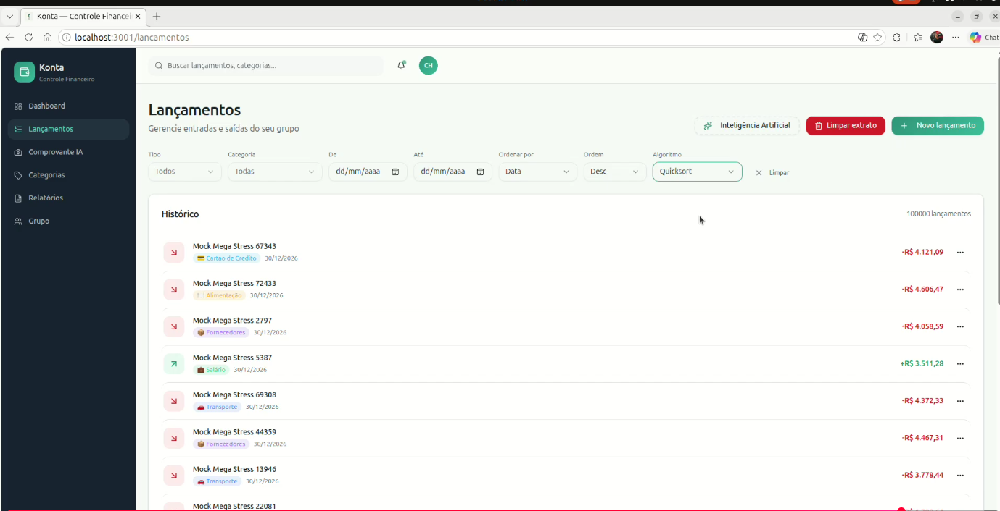
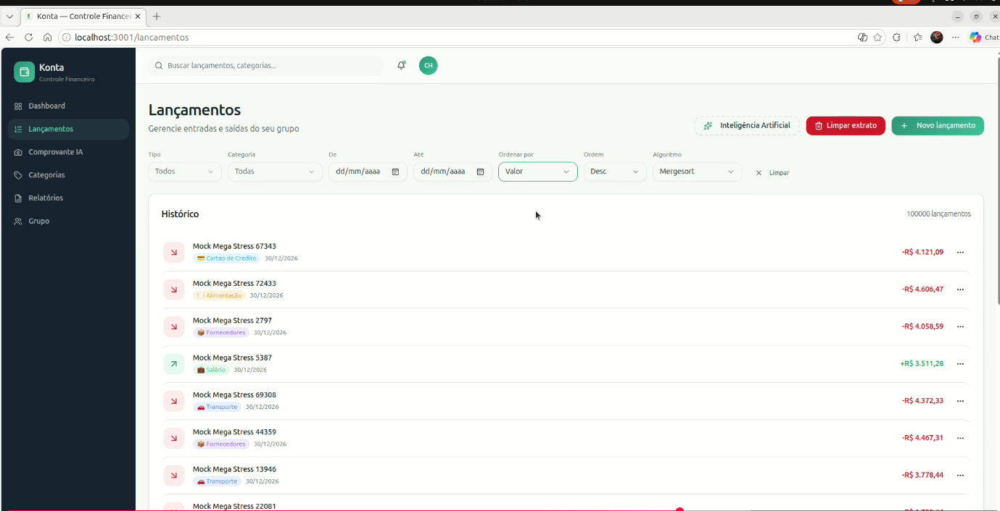
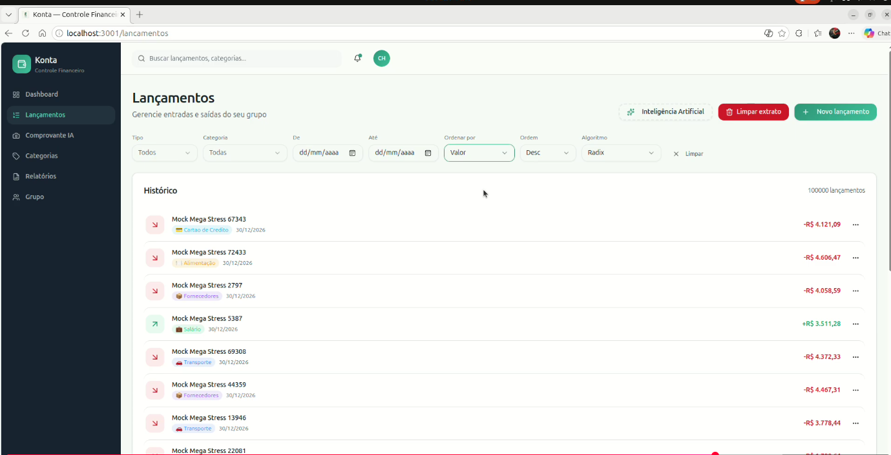
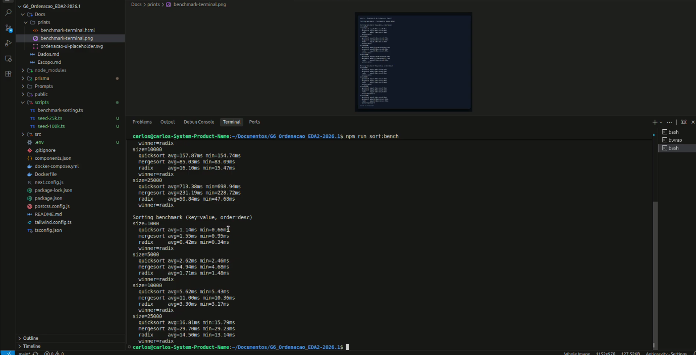

# G6_Ordenacao_EDA2-2026.1

Conteudo da Disciplina: Algoritmos de Ordenacao em Memoria (Quicksort, Mergesort, Radix Sort)

## Alunos
| Matricula | Aluno |
| -- | -- |
| 211030630 | Paulo Henrique Virgilio Cerqueira |
| 211061529 | Carlos Henrique de Souza Bispo |

## Sobre
Este projeto implementa o sistema Konta, um controle financeiro multi-tenant, com foco na aplicacao de algoritmos de ordenacao em memoria no modulo de Lancamentos.

O sistema permite:
- Gerenciar lancamentos financeiros com grupos e usuarios isolados.
- Ordenar lancamentos em memoria usando quicksort, mergesort e radix sort.
- Selecionar algoritmo, criterio de ordenacao e ordem na UI.
- Utilizar a API `GET /api/lancamentos` com parametros `sortAlgo`, `sortBy` e `sortOrder`.
- Comparar desempenho com benchmark local usando dados mockados.

## Screenshots
Adicione abaixo os caminhos das imagens do projeto em funcionamento:






## Instalacao
Linguagem: TypeScript (Next.js 14)<br>

Pre-requisitos:
- Node.js e npm.

Comandos para instalar dependencias e executar:

```bash
npm install
npm run dev
```

Benchmark de ordenacao:

```bash
npm run sort:bench
```

## Uso
1. Execute o projeto com `npm run dev`.
2. Acesse `http://localhost:3000`.
3. Abra o modulo de Lancamentos e use os filtros:
	- Algoritmo: quicksort, mergesort ou radix.
	- Ordenar por: date ou value.
	- Ordem: asc ou desc.
4. Opcional: use a API `GET /api/lancamentos` com os parametros `sortAlgo`, `sortBy` e `sortOrder`.

Observacao:
- Quando `sortAlgo` nao e enviado, a ordenacao ocorre no Postgres.

## Video de explicacao do projeto
https://youtu.be/k0IbV0Dxdh0

